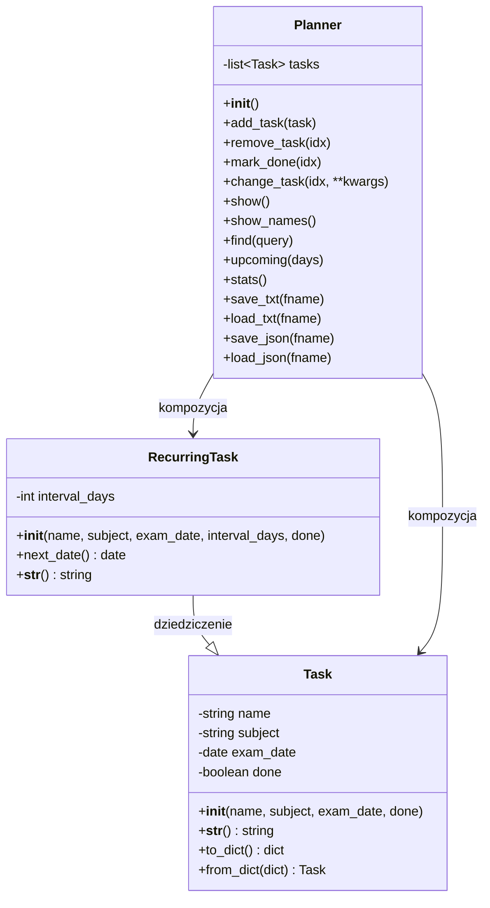

# Planer Nauki do Egzaminów

## Opis projektu

Interaktywna aplikacja konsolowa do zarządzania planem nauki i egzaminów. Program umożliwia dodawanie, edycję, wyszukiwanie i monitorowanie postępów w nauce różnych przedmiotów.

## Cele

- **Organizacja nauki**: Centralne miejsce do zarządzania wszystkimi zadaniami związanymi z nauką
- **Monitoring postępów**: Śledzenie ukończonych zadań i statystyk
- **Planowanie**: Podgląd nadchodzących egzaminów i terminów
- **Persistencja danych**: Zapis i odczyt danych z plików TXT i JSON
- **Zadania cykliczne**: Wsparcie dla powtarzających się zadań (np. codzienne powtórki)

## Autorzy

- **Autor**: [Dawid Sieczkowski]
- **Data utworzenia**: 06-2025

## Wymagania systemowe

- Python 3.12 lub nowszy
- Biblioteki standardowe: `json`, `datetime`, `functools`

## Instalacja i uruchamianie

### Uruchamianie

```bash
python planner.py
```

### Pierwsze uruchomienie

Program automatycznie utworzy przykładowe zadania:

- Powtórka lambda (Informatyka)
- Rozdział 3 - Chemia (Chemia)
- Słownictwo (Angielski) - zadanie cykliczne

## Funkcjonalności

### Menu główne

```
==== PLANER NAUKI DO EGZAMINÓW ====
1. Dodaj zadanie
2. Dodaj zadanie cykliczne
3. Wyświetl zadania
4. Wyświetl nazwy wszystkich zadań (map)
5. Zmień zadanie
6. Usuń zadanie
7. Oznacz jako wykonane
8. Szukaj zadania
9. Zadania na najbliższy tydzień
10. Statystyki
11. Zapisz do pliku TXT
12. Wczytaj z pliku TXT
13. Zapisz do pliku JSON
14. Wczytaj z pliku JSON
0. Wyjdź
```

### Główne funkcje

- Zarządzanie zadaniami: dodawanie, usuwanie, edycja, oznaczanie jako wykonane
- Zadania cykliczne
- Wyszukiwanie po nazwie i przedmiocie
- Statystyki
- Nadchodzące terminy
- Obsługa plików TXT i JSON

## Przykładowe dane wejściowe i wyjściowe

### Przykład 1: Dodawanie nowego zadania

```
Wybierz opcję: 1
Nazwa zadania: Kolokwium z algebry
Przedmiot: Matematyka
Data egzaminu (YYYY-MM-DD): 2024-07-15
-> Wykonuję: add_task
```

### Przykład 2: Wyświetlanie zadań

```
Wybierz opcję: 3
-> Wykonuję: show
1. Powtórka lambda | Informatyka | 2024-07-02 | ✘
2. Rozdział 3 - Chemia | Chemia | 2024-07-07 | ✘
3. Słownictwo | Angielski | 2024-06-28 | ✘ | co 2 dni
4. Kolokwium z algebry | Matematyka | 2024-07-15 | ✘
```

### Przykład 3: Wyszukiwanie zadań

```
Wybierz opcję: 8
Szukaj: chemia
-> Wykonuję: find
1. Rozdział 3 - Chemia | Chemia | 2024-07-07 | ✘
```

### Przykład 4: Statystyki

```
Wybierz opcję: 10
-> Wykonuję: stats
Statystyki przedmiotów:
Informatyka: 1
Chemia: 1
Angielski: 1
Matematyka: 1
Ukończonych zadań: 0 / 4
```

### Przykład 5: Format pliku JSON

```json
[
  {
    "name": "Powtórka lambda",
    "subject": "Informatyka",
    "exam_date": "2024-07-02",
    "done": false
  },
  {
    "name": "Rozdział 3 - Chemia",
    "subject": "Chemia",
    "exam_date": "2024-07-07",
    "done": true
  }
]
```

### Przykład 6: Format pliku TXT

```
Powtórka lambda|Informatyka|2024-07-02|False
Rozdział 3 - Chemia|Chemia|2024-07-07|True
Słownictwo|Angielski|2024-06-28|False
```

## Diagram klas



## Struktura modułów

```
planner.py
├── MODUŁY I PAKIETY
│   ├── json (obsługa plików JSON)
│   ├── datetime (operacje na datach)
│   └── functools.reduce (programowanie funkcyjne)
│
├── ZMIENNE GLOBALNE
│   ├── PLIK_TXT = "plan.txt"
│   └── PLIK_JSON = "plan.json"
│
├── FUNKCJE POMOCNICZE
│   ├── str_to_date(s)
│   ├── input_date(msg)
│   ├── pretty_print(data)
│   └── log_action(func)
│
├── KLASY I OOP
│   ├── Task
│   ├── RecurringTask
│   └── Planner
│
├── UI: INTERAKTYWNE MENU
│   └── menu()
│
├── FUNKCJA GŁÓWNA
│   └── main()
│
└── PUNKT STARTOWY
    └── if __name__ == "__main__": main()
```

## Wykorzystane koncepty programistyczne

### Programowanie obiektowe (OOP)

- Klasy: `Task`, `RecurringTask`, `Planner`
- Dziedziczenie, enkapsulacja, polimorfizm

### Programowanie funkcyjne

- Lambda: `lambda t: t.name`, `lambda acc, t: acc + int(t.done)`
- Map, Filter, Reduce
- Dekoratory: `@log_action`

### Struktury danych

- Lista, słownik, krotka, zbór

### Obsługa plików i wyjątków

- Try/Except, Assert, Context Manager
- JSON: serializacja i deserializacja

